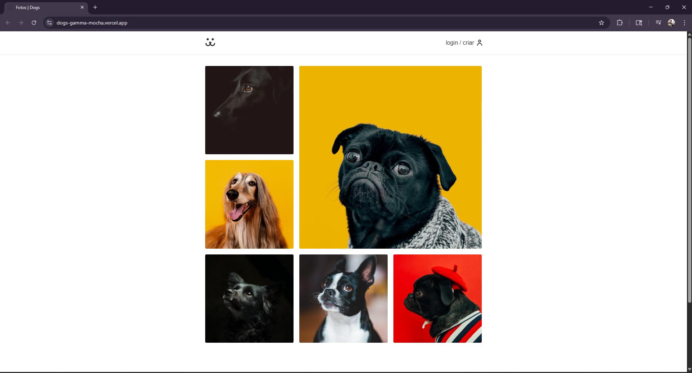
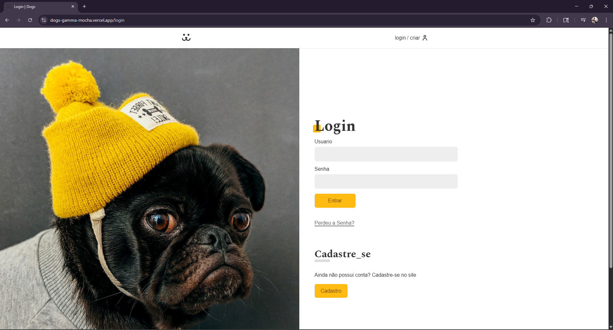
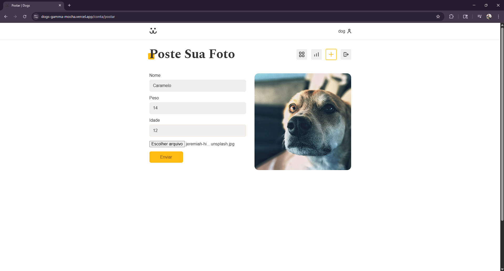
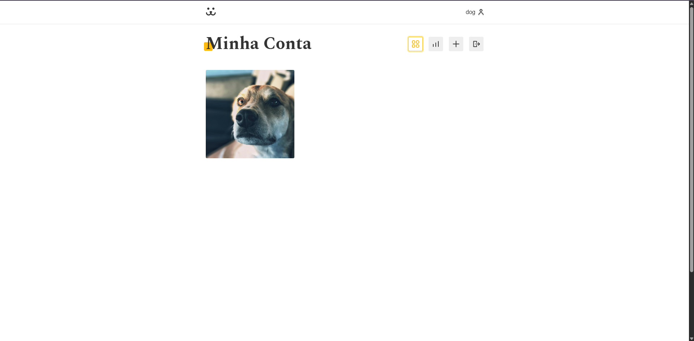
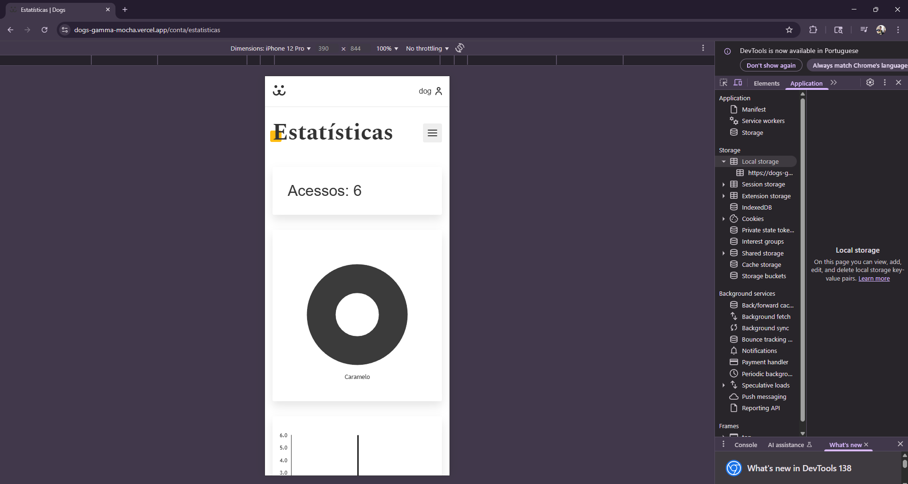

# 📸 Dogs 

Rede social de compartilhamento de fotos de cachorros desenvolvida durante o curso **React Completo** da [Origamid](https://www.origamid.com/), com foco em React moderno, Context API, rotas protegidas e consumo de API REST.

## ✨ Funcionalidades

- Cadastro e login de usuários
- Postagem de fotos com descrição, peso e nome do cachorro
- Feed público com paginação
- Comentários em fotos
- Perfil do usuário com suas próprias fotos
- Remoção de fotos
- Navegação protegida (rotas privadas)
- Upload de imagens via FormData
- Scroll infinito no feed

---

## 🔗 Live Preview

🚀 Você pode acessar o projeto funcionando aqui:  
👉 [**Clique para ver o site ao vivo**](https://dogs-gamma-mocha.vercel.app/)

## 🚀 Tecnologias Utilizadas

<p align="left">
  
  
  
  
  
  
  
  
</p>


## 🖼️ Preview

### Feed Fotos


### Pagina de Login


### Pagina postar foto


### Pagina Minha conta


### Mobile +  Pagina Estatísicas



---


## 📦 Instalação Local

Para rodar este projeto localmente:

```bash
# Clone o repositório
git clone https://github.com/IsaqueTADS/Dogs.git
cd Dogs

# Instale as dependências
npm install

# Inicie o projeto
npm run dev
```


## 📜 Licença

Este projeto foi desenvolvido com fins **educacionais** durante o curso [React Completo](https://www.origamid.com/curso/react-completo/) da **Origamid**.

🔓 **Uso livre para fins de estudo, portfólio e projetos pessoais.**  
📁 Nenhuma licença formal foi aplicada.

> ⚠️ Caso utilize trechos do código em projetos públicos, lembre-se de mencionar a Origamid como fonte original.


## 🙏 Créditos

Este projeto foi desenvolvido com base nas aulas do curso [**React Completo**](https://www.origamid.com/curso/react-completo/) da **Origamid**.

📚 Agradecimentos especiais ao professor **André Rafael** pelo conteúdo didático e prático.

## 📄 Certificado


📜 Você pode acessar o certificado original [clicando aqui](https://www.origamid.com/certificate/34dc50a0)

